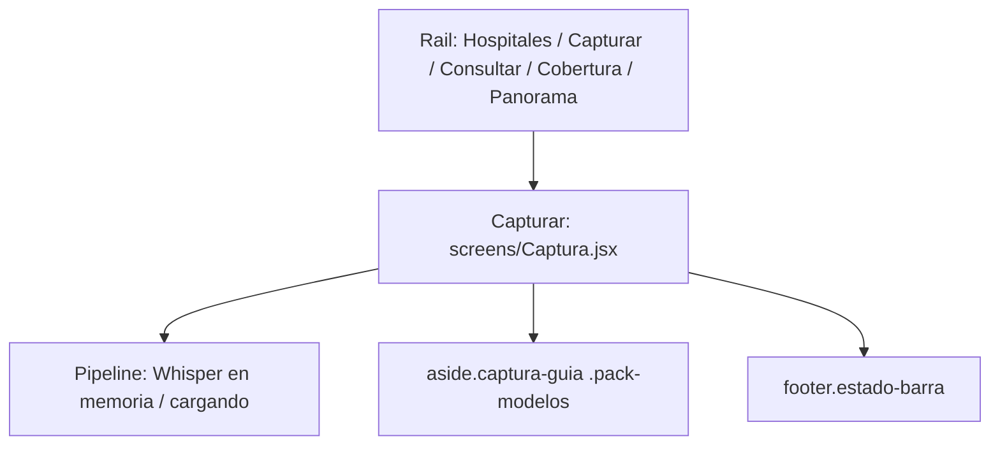

# WBS — Albatross: encaje de modelos QVAC (mini llmfit)

Fecha: 2026-09-11. Versión: 1.0. Estado: propuesto. No forma parte del camino crítico de visión delegada P2P.

## Objetivo y alcance

Decidir, con hardware medido, si esta computadora puede correr los modelos de producto **en cola** o **en caliente**, y mostrar ese veredicto donde el usuario ya gestiona Whisper y Qwen. El catálogo es cerrado: solo `@qvac/sdk@0.18.2` y los tres roles del prototipo (voz, extracción, placa). No hay ranking de Hugging Face, ni Ollama, ni nube.

Esta WBS no sustituye [WBS-p2p-vision.md](WBS-p2p-vision.md). El fit **confirma** la política de residencia; la placa delegada sigue siendo el recorte de inferencia P2P.

Referencias: [architecture.md](architecture.md), [reports/h1/1.2-entorno.md](../reports/h1/1.2-entorno.md), [reports/h1/1.4-vision.md](../reports/h1/1.4-vision.md), [reports/h1/1.5-decision.md](../reports/h1/1.5-decision.md).

## Descomposición

```text
8. Encaje de modelos QVAC
   8.1 Probe de hardware
   8.2 Catálogo y presupuestos
   8.3 Políticas y veredicto
   8.4 CLI y contrato JSON
   8.5 Motor: caliente vs secuencial
   8.6 UI en Capturar
   8.7 Validación en la laptop de demo
```

## Diccionario de paquetes

| ID | Entregable | Depende de | Criterio de aceptación |
| --- | --- | --- | --- |
| 8.1 | Probe con procedencia: CPU, RAM, GPU pinneada, VRAM, backend. | — | Cada cifra lleva `source` y `status` (`supported` / `estimated` / `unverified`). VRAM no se toma de `getSystemResources` (en esta Windows sale `unverified`). Si no hay `nvidia-smi`, se usa WMI `AdapterRAM` marcado `estimated`. Arrancar el worker QVAC no es requisito del probe. |
| 8.2 | Catálogo cerrado de tres roles con presupuesto medido (no `params × bytes`). | 8.1 | STT = Whisper Turbo F16; LLM = Qwen3-4B Q4_K_M; visión = VisionPsy Nano Flash Q4_K_M + mmproj Q8_0. VisionPsy Base no entra. El presupuesto suma worker + Electron + pesos + KV(ctx) + margen 20 %, anclado a la medición de RAM al 96 % con visión sola. |
| 8.3 | Cuatro políticas con `fit_level` y `allowed`. | 8.2 | `sequential_local`, `hot_stt_llm`, `hot_all`, `vision_delegated`. Niveles: `perfect` / `good` / `marginal` / `tooTight`. Caliente solo si `perfect` o `good`. VRAM `unverified` ⇒ caliente `allowed: false`. |
| 8.4 | `scripts/qvac-fit.mjs` imprime el JSON de 8.3. | 8.3 | `npm run fit` (o el script directo) sale 0 y escribe el mismo contrato que consumirá la UI. Prueba de contrato con el perfil de esta laptop fijado: `hot_all` y `hot_stt_llm` en `tooTight`; `sequential_local` permitido; `vision_delegated` recomendado. |
| 8.5 | Flag de residencia en `QvacInferenceEngine` (y visión, si corre local). | 8.3 | Default = unload del otro modelo (comportamiento actual). `hot` solo si 8.3 lo permite; entonces `warm(['stt','llm'])` deja de ser `INVALID_INPUT` y no se llama `unload` al cambiar de rol. Sin permiso, el motor ignora el pedido del usuario. |
| 8.6 | Veredicto y control en Capturar; una línea en la barra de estado. | 8.4, 8.5 | Ver sección UI. No hay pestaña nueva en el rail. El interruptor “mantener en caliente” está deshabilitado con motivo cuando `allowed: false`. |
| 8.7 | Corrida real en la RTX 2050 + 16 GiB. | 8.6 | JSON y UI coinciden: caliente bloqueado; secuencial visible; no se cargan Whisper y Qwen a la vez. Si VRAM sigue `estimated`, el pie lo dice. |

## Dónde entra en la UI

La UI de producto vive en Electron, rail + workspace de [ui/cib-ui-5/cib-ui/src/App.jsx](../ui/cib-ui-5/cib-ui/src/App.jsx). El usuario ya descarga y precarga modelos en **Capturar**, no en Hospitales ni en Consultar. El fit se agrega ahí.



### Superficie principal: aside de Capturar

Hoy [ui/cib-ui-5/cib-ui/src/screens/Captura.jsx](../ui/cib-ui-5/cib-ui/src/screens/Captura.jsx) ya tiene el bloque `.pack-modelos` (líneas ~310–327):

- si faltan pesos: botón **Descargar modelos (~4,1 GB)**
- si están: texto *“Al grabar se carga Whisper. Qwen entra al procesar, no juntos.”*

Ese párrafo se sustituye por un panel `FitModelos` en el mismo aside, **encima** de “Qué conviene decir”, sin mover el dictado ni el Pipeline.

Contenido del panel, en este orden:

1. GPU activa y VRAM (ej. `RTX 2050 · 4 GiB · estimado`).
2. Tres roles: Voz / Extracción / Placa, cada uno con cuantización y `fit`.
3. Política actual: **Uno a la vez** (secuencial) o **En caliente**.
4. Interruptor **Mantener modelos en caliente**. Si `hot_stt_llm.allowed === false`, el control está `disabled` y el motivo es una frase corta: *“Esta GPU no sostiene Whisper y Qwen juntos.”*
5. Si el veredicto recomienda `vision_delegated`, una línea: *“La placa corre en el otro proceso.”* No se convierte en un segundo producto.

El botón de descarga se queda. El de “Medir velocidad de Whisper” sigue siendo herramienta de desarrollo, no se mezcla con el fit.

### Superficie secundaria: barra de estado

[App.jsx](../ui/cib-ui-5/cib-ui/src/App.jsx) ya tiene `footer.estado-barra` y Capturar ya escribe ahí (“Modelos en disco…”, “Faltan modelos…”). Se añade una frase cuando hay fit:

- `Uno a la vez · RTX 2050`
- o, si caliente estuviera permitido y activo: `En caliente · Whisper y Qwen en memoria`

Una línea. Sin porcentajes de RAM en el pie.

### Superficie que ya existe y no se duplica

[Pipeline.jsx](../ui/cib-ui-5/cib-ui/src/components/Pipeline.jsx) ya muestra si Whisper está en memoria (`sttReady` / `warming`). No se le añade VRAM ni cuantizaciones. El fit no vive en el riel de etapas.

### Dónde no va

| Sitio | Por qué no |
| --- | --- |
| Nueva pestaña del rail | El rail es el flujo de base instalada (Hospitales, Capturar, Consultar). El fit es un ajuste de runtime, no una sección. |
| Hospitales / Ficha / Cobertura / Panorama | No cargan modelos. |
| App Expo `apps/mobile-capture` | La inferencia no corre en el celular en este alcance. |
| Ventana Whisper de desarrollo | Es un banco de velocidad, no la residencia de producto. |
| Modal al arrancar | No bloquear Capturar detrás de un “diagnóstico”. El probe corre en silencio; el panel está en el aside. |

### Cableado UI ↔ backend

1. `DesktopApi` gana `fit(): Promise<Result<QvacFitReport>>` y `setResidence(mode: 'sequential' | 'hot'): Promise<Result<QvacFitReport>>`.
2. [electron/preload.cts](../electron/preload.cts) y [electron/main.cts](../electron/main.cts) exponen `philips:fit` / `philips:set-residence`.
3. [ui/cib-ui-5/cib-ui/src/api/client.js](../ui/cib-ui-5/cib-ui/src/api/client.js) gana `estadoFit()` y `fijarResidencia(mode)`, junto a `estadoModelos` / `precargarModelos`.
4. Capturar llama `estadoFit()` al montar, en paralelo a `estadoModelos()`.
5. El interruptor llama `fijarResidencia('hot')`. El main **vuelve a evaluar 8.3**; si `allowed: false`, responde error y la UI no cambia.

En el navegador sin Electron, `estadoFit()` devuelve `null` y el panel no se renderiza (igual que el pack de modelos).

## Sprints tentativos

Paquete pequeño: unas **cinco horas** de implementación más una de validación en máquina. No pisa el sprint de visión delegada si se serializa detrás; si hay un agente libre, 8.1–8.4 pueden ir en paralelo al provider P2P porque no tocan `qvac-plate-vision.ts`.

| Sprint | Ventana | Paquetes | Salida verificable |
| --- | --- | --- | --- |
| F1 | 1,5 h | 8.1, 8.2, 8.3 | Módulo `src/application/qvac-fit.ts` + probe. Pruebas con perfil RTX 2050 / 16 GiB: caliente `tooTight`, secuencial permitido. |
| F2 | 0,5 h | 8.4 | `scripts/qvac-fit.mjs` imprime JSON. Se guarda una corrida real en `reports/h2/qvac-fit.json`. |
| F3 | 1,5 h | 8.5 | Flag en el motor. Prueba: con `hot` denegado, `warm(['stt','llm'])` sigue rechazando; con perfil ficticio `perfect`, no hay `unload` al cambiar de rol. |
| F4 | 1,5 h | 8.6 | Panel en `.pack-modelos` + línea en `estado-barra`. Interruptor deshabilitado en esta laptop. Capturar, dictado y Pipeline no se rompen. |
| F5 | 1 h | 8.7 | Corrida en la máquina de demo. Captura de pantalla del aside. El JSON y la UI dicen lo mismo. |

Reserva: VRAM `unverified` y `nvidia-smi` ausente. En ese caso el sprint F5 declara `estimated` y **no** habilita caliente.

## Veredicto esperado en esta demo

| Política | Fit | UI |
| --- | --- | --- |
| `sequential_local` | `good` | texto actual, más GPU |
| `hot_stt_llm` | `tooTight` | interruptor disabled |
| `hot_all` | `tooTight` | no se ofrece |
| `vision_delegated` | `good` | una línea, si el provider está previsto |

## Fuera de alcance

Elegir otro Qwen o Whisper porque “cabe mejor”; catálogo HF; TUI; iOS; fit en el celular; auto-descarga de un modelo distinto; declarar `perfect` con VRAM inventada.
